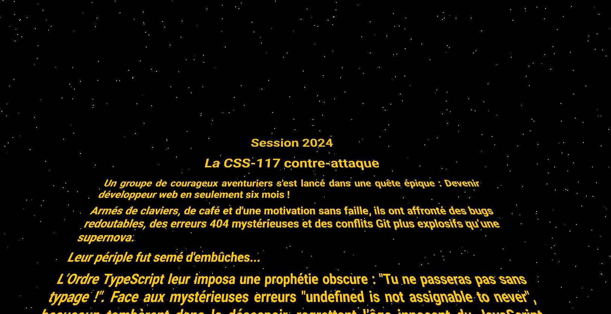

# Wild Code Scrolling

Récupérez le projet avec la commande :

`git clone git@github.com:FabriceAtlan/wild-scrolling.git`

Placez-vous dans le dossier source avec la commande :

`cd wild-scrolling`

<section style="padding: 1.25rem 0;">

</section>

<section style="padding: 1.25rem 0;">

</section>

<section style="padding: 1.25rem 0;">
</section>

