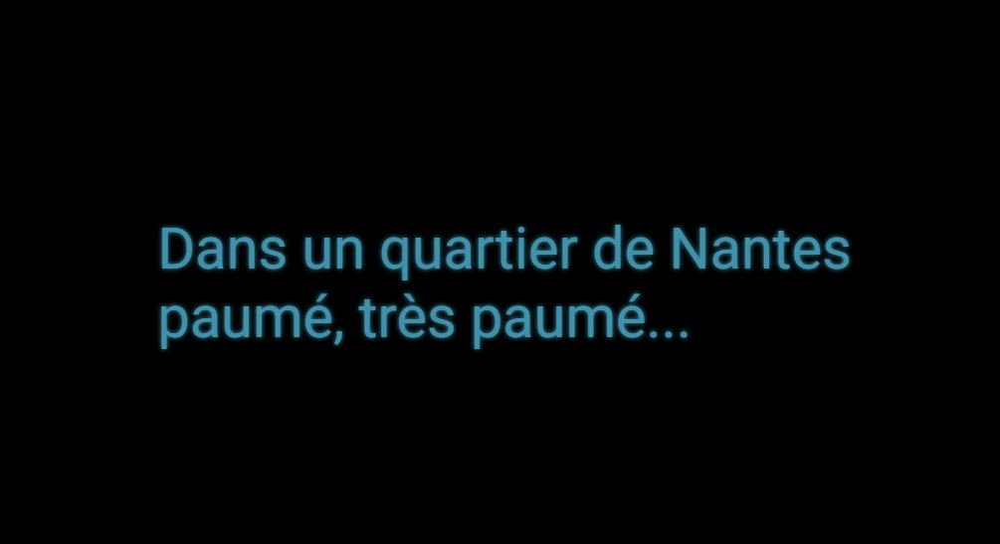

# Wild Code Scrolling

Ma formation Développeur web et Web mobile se termine aujourd'hui. Afin de marquer le coup, j'ai réalisé cette animation d'environ 2 minutes en HTML, CSS et JavaScript, et revisité l'introduction des films Star wars avec le texte défilant en scrolling verticale 3D.

Récupérez le projet avec la commande,

`git clone git@github.com:FabriceAtlan/wild-scrolling.git`

puis démarrer l'animation avec le fichier `index.html`.

Vous pouvez voir ci-dessous quelques captures d'écran :

<section style="padding: 1.25rem 0;">

</section>

<section style="padding: 1.25rem 0;">

</section>

<section style="padding: 1.25rem 0;">
</section>

